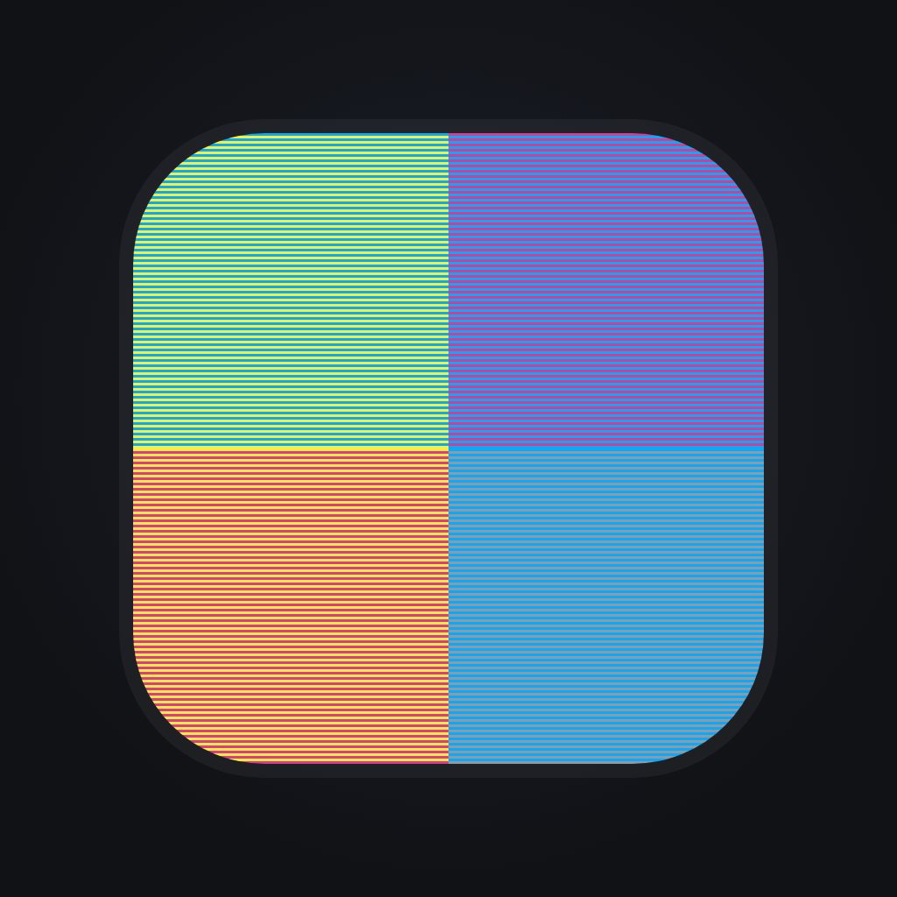
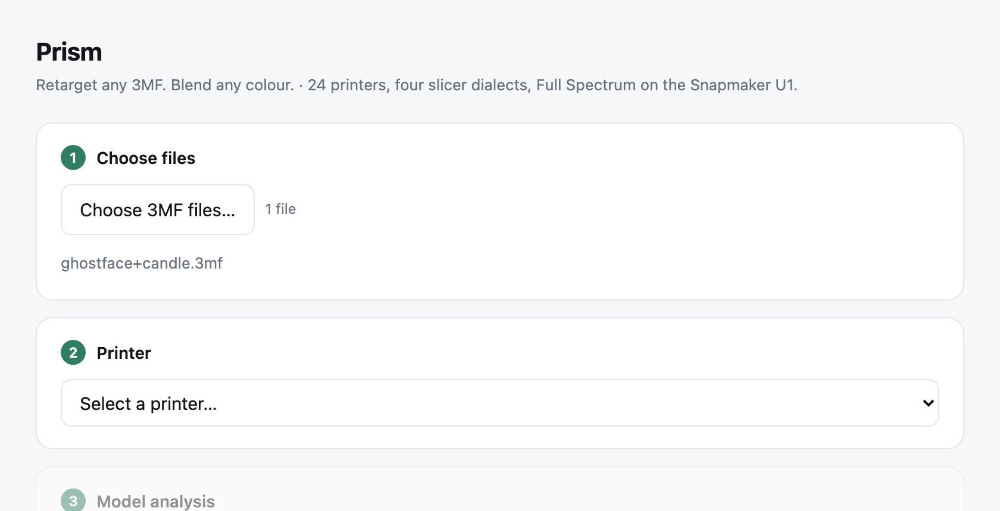
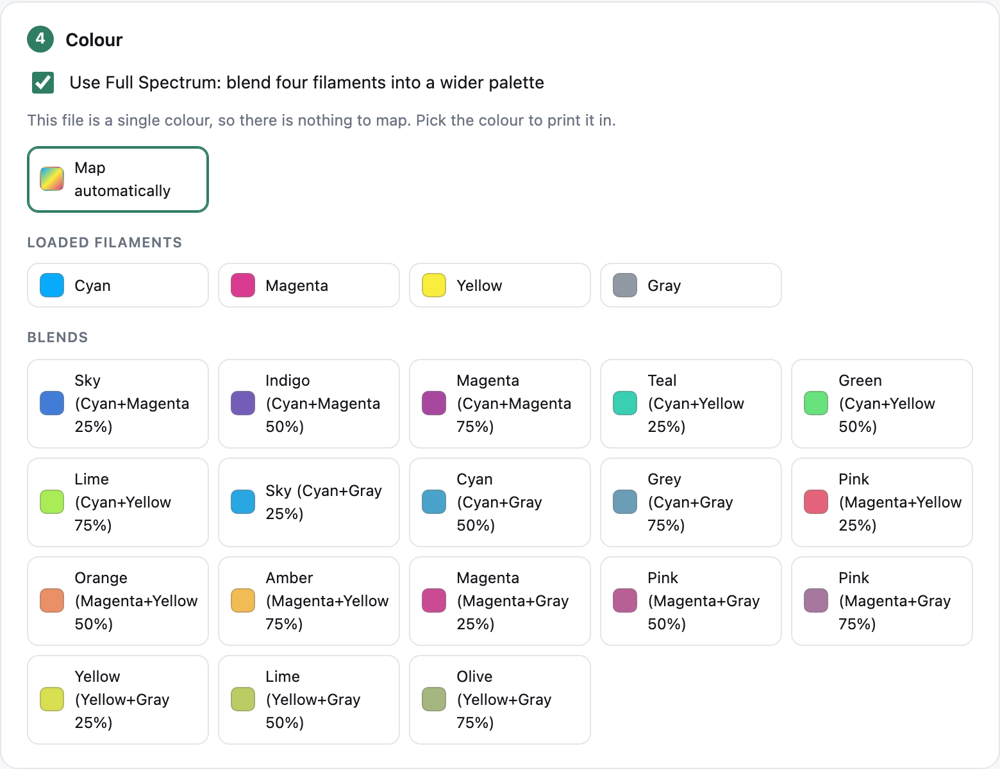

# Prism

**Retarget any 3MF. Blend any colour.**

Prism takes a 3MF project made for one printer and retargets it to another, so
it opens as a proper native project instead of a pile of broken settings. It
covers 24 machines across Creality, Snapmaker, Bambu Lab, Prusa, Elegoo, Voron,
Qidi, Sovol, Anycubic and Flashforge.

On the Snapmaker U1 it also does Full Spectrum colour. Load cyan, magenta,
yellow and grey, and Prism works out the blends, matches your model's colours to
the closest one the printer can actually produce, and paints the file so the
slicer prints them. You never mix by hand and you never paint.

## Supported printers

| Make | Printers |
|---|---|
| **Anycubic** | Kobra 2 (`kobra2`) |
| **Bambu Lab** | X1 Carbon (`x1c`), P1S (`p1s`), P1P (`p1p`), A1 (`a1`), A1 mini (`a1mini`), X1E (`x1e`) |
| **Creality** | K2 (`k2`), K2 Plus (`k2plus`), K2 Pro (`k2pro`), K1C (`k1c`), K1 Max (`k1max`), K1 SE (`k1se`), Ender-3 V3 (`ender3v3`), Ender-3 V3 KE (`ender3v3ke`), Hi (`hi`) |
| **Elegoo** | Neptune 4 Pro (`neptune4pro`) |
| **Flashforge** | AD5X (`ad5x`) |
| **Prusa** | MK4S (`mk4s`), CORE One (`coreone`) |
| **Qidi** | Q1 Pro (`qidiq1pro`) |
| **Snapmaker** | U1 (`u1`) **Full Spectrum** |
| **Sovol** | SV06 (`sv06`) |
| **Voron** | 2.4 300 (`voron24-300`) |

Adding one is a data job, not a code job: see [rebuilding the printer data](#rebuilding-the-printer-data).

## Install

**Download the [latest release](https://github.com/4bsxhwr68n-debug/prism/releases/latest).**

**macOS.** Unzip and drag `Prism.app` where you like. On first run macOS will say
it is from an unidentified developer, because the app is ad-hoc signed rather
than notarised: right-click it and choose Open, once. It uses the Python already
on your Mac, so there is nothing to install.

**Windows.** Unzip anywhere and double-click `Prism.bat`. You need Python 3 from
[python.org](https://www.python.org/downloads/) or the Microsoft Store. No
packages, no pip, no virtualenv.

## Build from source

If you would rather build it yourself, it takes about ten seconds and needs
nothing beyond what your machine already has.

    git clone https://github.com/4bsxhwr68n-debug/prism.git
    cd prism
    ./macos/build.sh                 # writes ~/Desktop/Prism.app
    ./windows/build.sh               # writes ~/Desktop/Prism (Windows).zip

Pass a path to either script to put the result somewhere else.

`macos/build.sh` compiles the droplet with `osacompile`, copies the engine and
printer data into the bundle, sets the bundle identity and ad-hoc signs it. It
needs macOS, because `osacompile` and `codesign` are macOS tools.
`windows/build.sh` only zips files, so it runs anywhere.

`./release.sh v1.0.0` builds both release artefacts at once.

**Or skip the app.** The engine is a plain script and works on its own:
`python3 engine/optimise3mf.py --interactive yourfile.3mf`

## Use

Double-click for the window: choose files, pick a printer, read the analysis,
pick a mode, pick a colour, convert. Output lands next to the original as
`<name> - KEY.3mf`.

Or drop `.3mf` files straight onto the app icon for the quick path.

## What it actually does

- Rebuilds the project config from a proven per-slicer template plus the vendor
  profiles for the chosen machine, matched by `compatible_printers`, the same
  mechanism the slicers use.
- Maps filament slots by material type, preserving colours and per-object
  extruder assignments.
- Carries designer intent across where it is valid on the target: walls, infill,
  supports, brim, seam. Enum values are checked against the slicer binaries, so
  a setting the target cannot honour is dropped rather than silently accepted.
- Looks at the mesh. Rounded tops that would print as stair rings get a finer
  per-object layer height. Bed fit and overhangs are reported per object.
- Never modifies geometry. It is hash-verified on every run, and the plate,
  object and instance structure is asserted intact.

Some printers carry standing defaults, applied after the source's own settings
because they are your preferences for your own machine rather than the
designer's guess about someone else's. The Snapmaker U1 and the Creality K2
family get gyroid infill, 3 top interface layers and a 0.25mm top Z distance for
supports. Anything they override is named in the run output, so nothing changes
quietly, and `--keep-source` turns them off. Other printers keep whatever their
vendor process profile ships, because the right values there are not known yet.

Three modes: **speed** for coarser layers, **balanced** as the sensible default,
**quality** for the finest layers plus ironing on large flat tops. A project
authored finer than the mode keeps its finer layer height; only speed coarsens.

## Full Spectrum

The U1 has four independent nozzles and no mixing chamber, so colour is never a
ratio in the gcode. Snapmaker Orca blends by alternating thin layers of two
filaments until the eye reads them as one colour. Prism sets that up:

- Loads the four semi-translucent Full Spectrum filaments and generates the
  palette: every pair at three blend strengths, 18 mixes plus the 4 solids.
- Matches colour in CIE Lab, not RGB, because RGB distance picks visibly wrong
  blends. The blend colour comes from the same pigment model the slicer uses, so
  what Prism promises is what the slicer shows. It is subtractive: cyan plus
  yellow makes green, not grey.
- Paints the model. Assigning a part to a blend is not enough on its own,
  because the slicer only blends painted geometry. A model that is already
  painted is recoloured rather than painted over, so multi-colour artwork
  survives.
- Halves the layer height so a full colour cycle fits inside one nominal layer.
  Without that, flat faces print one filament neat and band visibly.

Honest edges: the gamut has no dark end, so a near-black target gets the closest
available colour and the run says so. Blending roughly doubles print time and
the prime tower uses about 0.11g per tool change. Use the real semi-translucent
filaments; opaque ones stripe on shallow slopes.

## Command line

    python3 engine/optimise3mf.py --list
    python3 engine/optimise3mf.py --printer <key> --report file.3mf
    python3 engine/optimise3mf.py --printer <key> --mode quality file.3mf
    python3 engine/optimise3mf.py --interactive file.3mf

    --single [#RRGGBB]          one filament for the whole model
    --spectrum                  Full Spectrum blending (U1)
    --spectrum-list             every colour the printer can make, with ids
    --spectrum-colour C         #RRGGBB, a palette id, or a name like Teal
    --spectrum-step MM | off    layer height in painted zones
    --spectrum-biases 25,50,75  blend strengths per pair
    --keep-source               ignore this printer's standing defaults
    --dome off|H                override the rounded-top layer height
    --out PATH                  explicit output path

## Rebuilding the printer data

`engine/data/` is baked from the vendor profiles inside installed slicers. After
a major slicer upgrade, run `python3 engine/bake.py` with those slicers
installed; it writes `out_v2/`, and you copy `printers/` and `index.json` into
`engine/data/`.

## If something goes wrong

**"Prism is damaged and can't be opened"** on macOS. The app is ad-hoc signed
rather than notarised. Right-click it and choose Open, or run
`xattr -dr com.apple.quarantine /path/to/Prism.app`.

**"Python 3 is required but was not found"** on Windows. Install it from
[python.org](https://www.python.org/downloads/) or the Microsoft Store and run
`Prism.bat` again. No packages are needed.

**The blend prints as one colour.** Check the filament table in your slicer
after slicing. Roughly balanced usage across two filaments, with hundreds of
tool changes, means it worked. Almost everything on one filament means the model
reached the slicer unpainted.

**Colours look wrong.** The gamut has no dark end, because four semi-translucent
filaments with no black cannot reach a deep shade. Run `--spectrum-list` to see
every colour the printer can actually make.

**The slice fails on max print height.** Supports or the prime tower are running
past the top of the model. Please report it with the source file.

## Contributing

Issues and pull requests are welcome, particularly new printer profiles and any
slicer that rejects a converted file. Attach the source `.3mf` where you can:
almost everything here is a file-format bug and they are hard to guess at.

## Support

Prism is free and there are no accounts, licence keys or telemetry. If it saved
you a failed print, [buy me a coffee](https://buymeacoffee.com/prismprints).

## Licence

AGPL-3.0. Parts of the Full Spectrum support are derived from Snapmaker Orca,
which is AGPL-3.0, and `engine/mixer.py` is a transliteration of an MIT-licensed
pigment model. See [NOTICE.md](NOTICE.md) for exactly what came from where.

Not affiliated with or endorsed by Snapmaker, Creality, Bambu Lab, Prusa, or any
other printer manufacturer.
