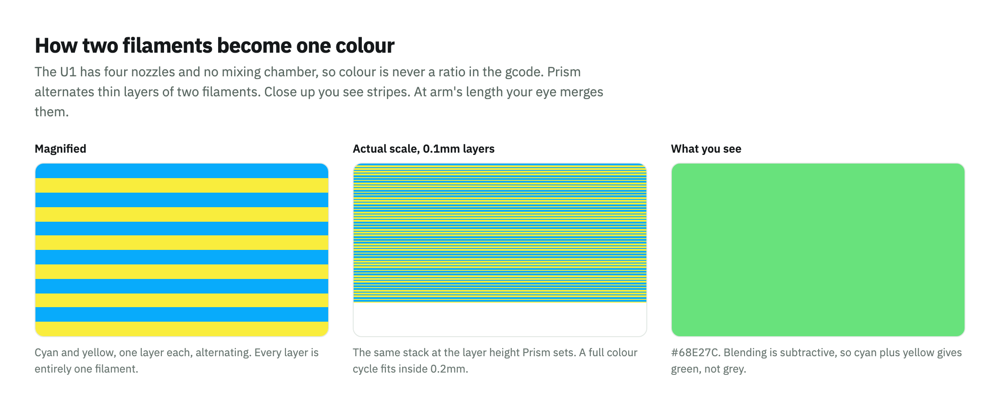
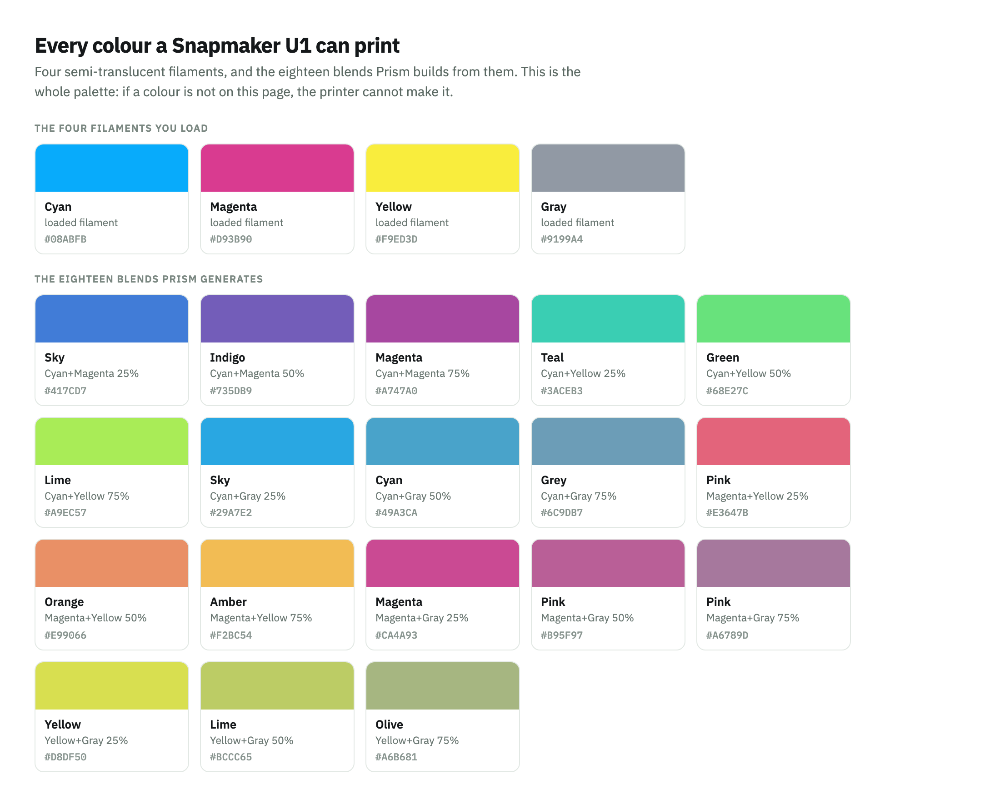
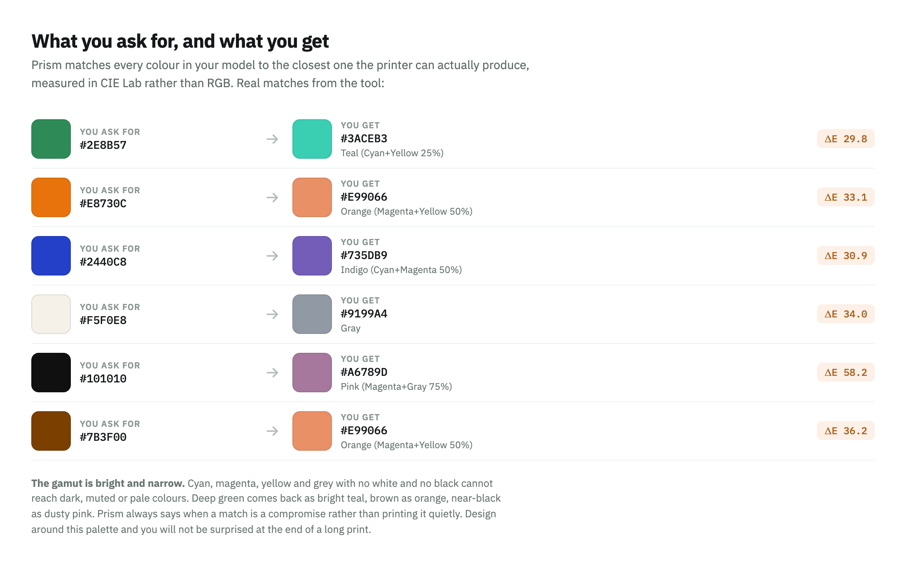

# Colour and painting

**Short answer: Prism generates the colour mapping automatically. It is not a
painting tool, and you never mix filaments by hand.**

You can still decide the colours. There are three ways to do it, and they differ
only in where the colour intent comes from.

---

## What Prism actually does

A Snapmaker U1 has four independent nozzles and no mixing chamber, so colour is
never a ratio in the gcode. Full Spectrum works by alternating thin layers of two
filaments until your eye reads them as one colour.

Prism does the three jobs that sit between "I want green" and a file that prints
green:

1. **Builds the palette.** It loads the four semi-translucent Full Spectrum
   filaments and generates every pair at three blend strengths. That is 18 mixes
   plus the 4 solids, 22 colours in total.
2. **Matches your colours to it.** Each colour in your model is matched to the
   closest one the printer can actually produce. Matching runs in CIE Lab rather
   than RGB, because RGB distance picks blends that look visibly wrong.
3. **Paints the file.** This is the part that is easy to miss: the slicer only
   blends geometry that has been *painted*. Assigning a part to a mixed filament
   shows the right swatch and then prints as the first component. Prism writes
   the paint data itself, which is the same data the slicer's paint tools
   produce.

It also halves the layer height, so a full colour cycle fits inside one nominal
layer. Without that, flat faces print one filament neat and band visibly.

---

## The three ways to choose colours

### 1. Map the model's own colours (the default)

If the model already carries colour, Prism matches each one to the nearest blend
and repaints it. Nothing to set up: pick the printer, turn on Full Spectrum,
leave the colour choice on **Map automatically**.

Colour already in a model means either of these, and Prism reads both:

- **Painted geometry.** Anything painted in a slicer and saved as a 3mf.
- **Per-part assignments.** A model built from separate parts, each assigned to a
  filament slot.

A model that is already painted is **recoloured, not painted over**. A
two-colour model stays two colours; each one moves to the nearest blend. Your
artwork survives.

The run tells you exactly what it did:

    slot 1 #69B94E -> #68E27C Green (Cyan+Yellow 50%)
    slot 2 #C050FF -> #A747A0 Magenta (Cyan+Magenta 75%)
    recoloured 220,852 painted triangles onto the blends

### 2. Pick one colour for the whole model

For a single-colour model there is nothing to map, so choose the colour instead.
The window shows the palette as swatches, grouped into the four loaded filaments
and the eighteen blends. Pick one and the whole model prints in it.

From the command line:

    prism --printer u1 --spectrum --spectrum-colour 9        # a palette id
    prism --printer u1 --spectrum --spectrum-colour "#2E8B57"
    prism --printer u1 --spectrum --spectrum-colour Teal

`--spectrum-list` prints every colour the printer can make, with its id.

### 3. Paint it yourself first, then convert

**This is the answer if you want manual control over which areas get which
colour.** Prism has no painting canvas, and adding one would be a worse version
of what your slicer already does well.

So paint in the slicer, then let Prism translate:

1. Open the model in your slicer and paint it with the standard paint tools,
   using whatever filament colours you like. They do not have to be colours you
   own.
2. Save it as a 3mf project.
3. Run that file through Prism with Full Spectrum on.
4. Prism matches each painted colour to the nearest blend it can print, and
   rewrites the painting to match.

The colours you paint with matter, because they are the targets Prism aims at.
Paint an area in deep green and you get the closest printable green. The areas
you defined are preserved exactly; only the colours move.

---

## What it can and cannot produce

This is the whole palette. If a colour is not here, the printer cannot make it.

**The gamut is bright and narrow, and this is the part worth reading twice.**
Cyan, magenta, yellow and grey with no white and no black cannot reach dark,
muted or pale colours. Not just black: a deep green comes back as bright teal, a
brown as orange, an off-white as mid grey.

Those are real matches from the tool, with the perceptual distance beside each.
Prism always says when a match is a compromise rather than printing it quietly:

    slot 2 #101010 -> #A6789D Pink (Magenta+Gray 75%)  (closest available)

So run `--spectrum-list`, or open the colour picker in the window, **before** you
commit to a colour scheme. Designing around this palette beats discovering its
edges at the end of a twenty hour print.

---

## What it costs

Blending means constant tool changes, and thinner layers mean more of them.

| | |
|---|---|
| Print time | roughly double |
| Prime tower | about 0.11g per tool change |
| Layer height | halved, so a colour cycle fits in one nominal layer |

Those are measured from a real slice, not estimated.

---

## Checking it worked

Slice the converted file and look at the filament table.

- **Roughly balanced usage across two filaments, with hundreds of tool changes.**
  That is a real blend.
- **Almost everything on one filament, with few changes.** The model reached the
  slicer unpainted, and it is printing the first component. Worth reporting.

Open the result in the slicer Prism names when it finishes. Each output is a
native project for one slicer, and opening a Snapmaker project in Creality Print
fails on Snapmaker's own gcode macros with an error that reads like a corrupt
file.

---

## Summary

| You want | Do this |
|---|---|
| The model's existing colours, printed as close as the printer can | Nothing. It is the default. |
| One colour for the whole model | Pick a swatch, or `--spectrum-colour` |
| Specific areas in specific colours | Paint in your slicer first, then convert |
| To know what is achievable | `--spectrum-list` |
| The source colours left alone | `--keep-source` |
